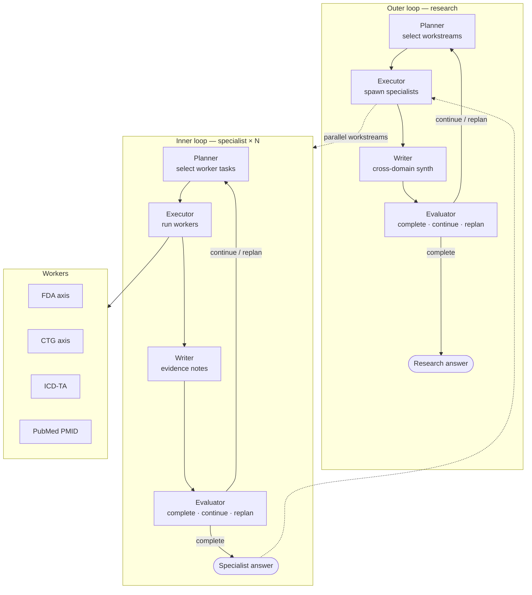
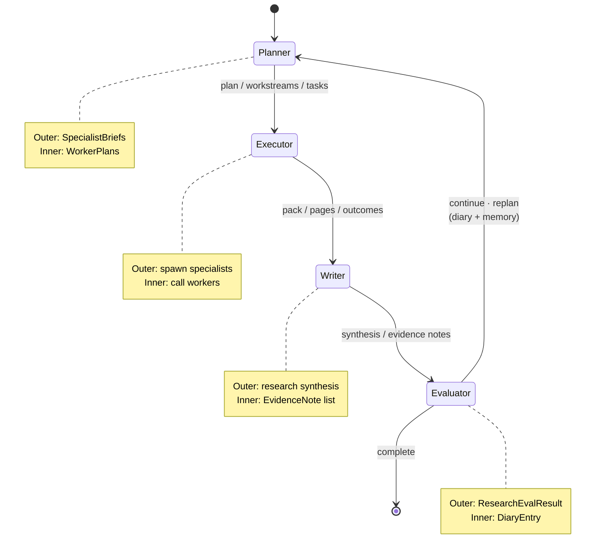
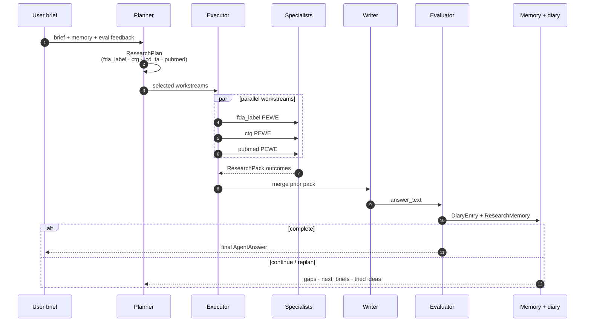
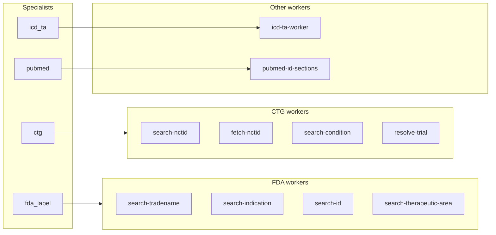
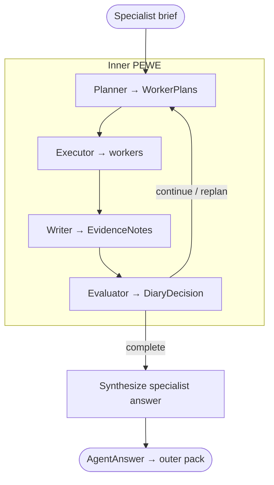
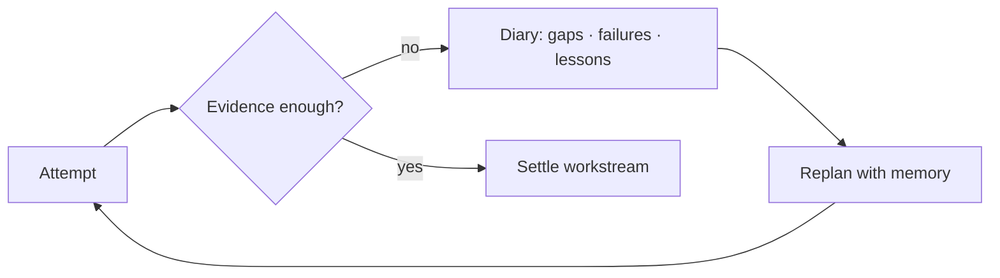
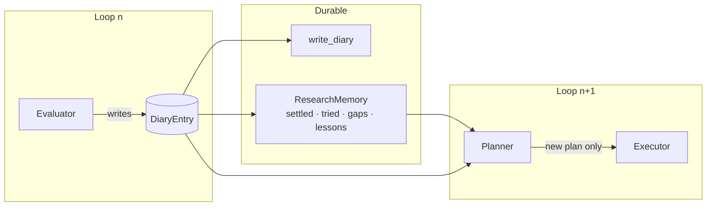
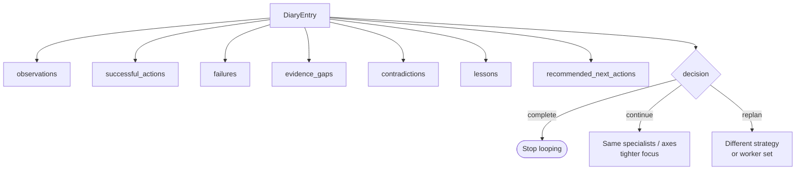

# info-harness

CLI and agent harness for biomedical research workflows: FDA labels, ClinicalTrials.gov, ICD therapeutic areas, and PubMed — composed as nested **PEWE** loops.

**PEWE** = **P**lanner → **E**xecutor → **W**riter → **E**valuator. The same rhythm runs at two scales: an _outer_ research loop that picks specialists, and _inner_ specialist loops that dispatch workers.

## Prerequisites

- Python 3.12 or later
- [`uv`](https://docs.astral.sh/uv/getting-started/installation/) for environment and dependency management

## Setup

```bash
uv sync --group dev
uv run pre-commit install
cp .env.example .env   # optional; never commit .env
```

Quick start:

```bash
uv run python src/main.py agent research "Keytruda indications and related pivotal trials"
```

Full command list → [`docs/commands.md`](docs/commands.md) · Folder map → [`docs/layout.md`](docs/layout.md)

---

## The idea: nested loops

Research is not a single agent call. It is a **loop of loops**:

| Layer                  | Role                                                                                                            | PEWE meaning                                                                                                        |
| ---------------------- | --------------------------------------------------------------------------------------------------------------- | ------------------------------------------------------------------------------------------------------------------- |
| **Outer — research**   | Decompose the brief into specialist workstreams; synthesize across domains; decide continue / replan / complete | Planner picks specialists; executor _spawns_ them; writer synthesizes the pack; evaluator gates the next outer loop |
| **Inner — specialist** | Own one domain (FDA, CTG, ICD-TA, PubMed) until evidence is good enough                                         | Planner picks worker tasks; executor runs them; writer turns pages into notes; evaluator gates the next inner loop  |
| **Workers**            | Thin tool agents — one HTTP / HC axis each                                                                      | No PEWE of their own; called by the specialist executor                                                             |



---

## PEWE in one picture

Every PEWE cycle shares the same four-stage contract. Each stage emits an `AgentAnswer` for the next stage; the evaluator writes a diary entry that the next planner must respect.



---

## Outer loop — research

`agent research` runs `run_research`: durable memory across loops, parallel specialist concurrency, and hard gates (NCT / PMID coverage) after the LLM evaluator.



Typical handoff: **FDA** surfaces NCT ids → **CTG** fetches sections / references → **PubMed** only when real PMIDs exist. The outer planner does not call HTTP tools; specialists already own their inner PEWE.

Env knobs: `RESEARCH_MAX_LOOPS` (default `2`), `RESEARCH_SPECIALIST_CONCURRENCY` (default `3`).

---

## Inner loop — specialists

Each specialist is the same PEWE pattern scoped to one domain. The executor dispatches **workers** (single-purpose tool agents), not other PEWE loops.





Workers are the leaf: CLI-callable (`agent fda-search-tradename`, `agent ctg-fetch`, …) and also the tools specialists plan against. Eval layers mirror the stack: `--layer worker` vs `--layer inner`.

---

## Why loops (not one-shot)



- **Planner** sees settled workstreams, tried-idea fingerprints, and open gaps — so loop _n+1_ does not replay loop _n_.
- **Evaluator** chooses `complete` / `continue` / `replan`; coverage enforcers can force continue when NCTs or PMIDs are missing from the pack.
- **Writer** is the only stage that speaks to the user (outer) or accumulates durable notes (inner).

---

## Diary — structured memory between loops

The diary is the evaluator’s handoff to the **next** planner. It is not the evidence ledger (that’s `EvidenceNote` / the research pack). Without it, PEWE would re-ask the same questions every loop and forget what already failed.

Shared schema: `DiaryEntry` (`src/model/research/diary_entry.py`). Outer research maps `ResearchEvalResult` → the same fields via `eval_to_diary_entry`, then folds extras into `ResearchMemory`.



### `DiaryEntry` fields

| Field                      | Role                                              |
| -------------------------- | ------------------------------------------------- |
| `loop`                     | Which PEWE pass produced this entry               |
| `observations`             | What happened this loop (neutral facts)           |
| `successful_actions`       | What worked — do not undo                         |
| `failures`                 | What broke (HTTP, empty pages, bad ids)           |
| `evidence_gaps`            | What the brief still needs                        |
| `contradictions`           | Conflicting specialist / worker signals           |
| `lessons`                  | Durable takeaways the next planner must keep      |
| `recommended_next_actions` | Concrete next moves (often named NCT/PMID digits) |
| `decision`                 | `continue` · `replan` · `complete`                |



### Why it matters

1. **Closes the PEWE circuit** — Evaluator → diary → Planner is the only feedback channel. Stage answers are for the _next stage in the same loop_; the diary is for the _next loop_.
2. **Stops thrashing** — Planners are told what already succeeded, failed, and was tried. Outer memory adds fingerprints so the same focus/seeds are not replayed as “new.”
3. **Separates judgment from evidence** — Evidence notes hold _what we found_; the diary holds _what that means for planning_. Mixing them makes synth noisy and replanning vague.
4. **Same contract, two scales** — Inner specialists write `DiaryEntry` directly. Outer research writes the same spine plus `next_briefs` / `reject_directions` / `force_rerun_workstream_ids` on `ResearchEvalResult`, then persists the shared diary fields for the run.

Entries are append-only per run (`write_diary`); planners receive the growing list (and outer `diary_tail` in memory prompts) so history compounds instead of resetting.

---

## Docs index

| Doc                                      | Contents                           |
| ---------------------------------------- | ---------------------------------- |
| [`docs/commands.md`](docs/commands.md)   | HTTP, agent, and eval CLI examples |
| [`docs/layout.md`](docs/layout.md)       | `src/` folder map and conventions  |
| [`src/cli/readme.md`](src/cli/readme.md) | CLI packaging rules                |

CI: [`.github/workflows/lint.yml`](.github/workflows/lint.yml) runs Python lint and builds `web/`. On push it deploys `web/dist` to `gh-pages` with `VITE_APP_BASENAME=/info-harness`. Set repo secrets `VITE_COGNITO_USER_POOL_ID`, `VITE_COGNITO_USER_POOL_CLIENT_ID`, `VITE_API_BASE_URL`, and `VITE_AGENTIC_CHAT_STREAM_URL` (plus optional `VITE_COGNITO_REGION` and `VITE_COGNITO_IDENTITY_POOL_ID`). `VITE_API_BASE_URL` is the HTTP API. Chat create, list, messages, and run polling use it. `VITE_AGENTIC_CHAT_STREAM_URL` is the agentic-chat-stream Function URL (`invoke_mode = RESPONSE_STREAM`) and is used only for `GET /runs/{id}/events/stream`. Leave that variable empty for local uvicorn so both calls use `http://127.0.0.1:8080`. After Terraform creates the stream function, set GitHub secret `LAMBDA_STREAM_FUNCTION_NAME` (or rely on `{LAMBDA_FUNCTION_NAME}-stream`) so image pushes update both functions.

---

## Web API (local or Lambda)

The CLI is unchanged (`src/main.py`). The chat UI and Lambda image share the same research pipeline.

```bash
uv run uvicorn api.app:app --host 0.0.0.0 --port 8080 --reload
cd web && npm install && npm run dev
```

Open [http://127.0.0.1:3000](http://127.0.0.1:3000) and sign in with Cognito. The app sends that access token on every API call. FastAPI checks it against the same user pool, then the research run uses it for HC requests. CLI `cognito-login` is unchanged and still writes `.cognito_tokens.json` for commands that are not the web app.

Copy [`web/.env.sample`](web/.env.sample) to `web/.env.local` and set the same `COGNITO_*` values as `.env` plus `VITE_API_BASE_URL=http://127.0.0.1:8080`. Leave `VITE_AGENTIC_CHAT_STREAM_URL` empty locally.

- `POST /chats/{id}/messages` stores the prompt and starts a run. The brief is the prompt alone on the first turn, and **last assistant answer + next prompt** after that.
- `GET /runs/{id}/events/stream` pushes PEWE stage lines (SSE). `GET /runs/{id}/events?after=` is the poll fallback. `GET /runs/{id}` returns the final answer.
- On Lambda, the image runs `uvicorn api.app:app` behind the Lambda Web Adapter. The HTTP API function overrides `AWS_LWA_INVOKE_MODE=buffered`. A second function, `agentic-chat-stream`, overrides `response_stream` and serves the Function URL. `POST /messages` returns a `run_id`, then asynchronously invokes `POST /internal/research` on the buffered function. Diary files stay on local disk (`data/diary` locally, `/tmp/diary` on Lambda) and are not written to S3. Chat history, stage events, and the final answer go to `CHAT_S3_BUCKET`. Without that bucket, Lambda writes `/tmp/chats`, which disappears when the execution environment is replaced. Build: `DOCKER_BUILDKIT=1 docker build --ssh default -t info-harness .`
- [`.github/workflows/push-lambda-ecr.yml`](.github/workflows/push-lambda-ecr.yml) builds that image on pushes to `main` (and `workflow_dispatch`), pushes it to ECR, and updates the Lambda function. Set repo secrets `AWS_ACCESS_KEY_ID`, `AWS_SECRET_ACCESS_KEY`, `ECR_REGISTRY`, `LAMBDA_ECR_REPOSITORY`, `LAMBDA_FUNCTION_NAME`, and `PRIVATE_REPO_TOKEN` (`AWS_REGION` defaults to `eu-west-2`).
